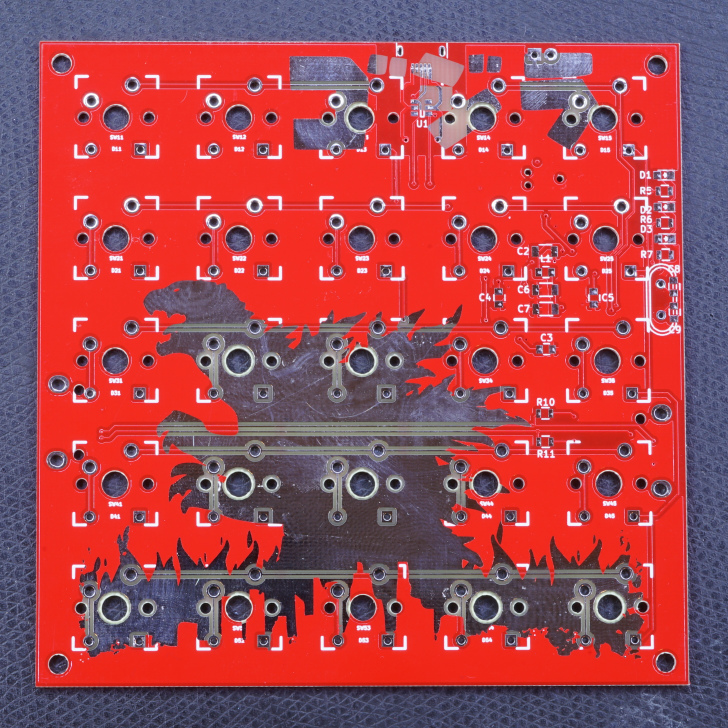

5x5 aka Gojira!
===============

This is my first custom keyboard, a 5x5 cherry mx matrix based on the STM32F1
with libopencm3. The project contains firmware, schematics and a board layout
in kicad.

This project is intended as a platform for custom keyboard development. It
supports:
- usb keyboard scancodes
- bios boot and nkro
- system / consumer codes
- generation of mouse events
- usb serial interface

The board is programmed using a 6-pin TagConnect, that must be wired to a STM
Discovery SWD/STLink programming port. Note that the PCB includes footprints
for firewire connectors for future i2c experiments. The current firmware has no
code for this yet.

Building
========

    git submodule init
    git submodule update
    make -C libopencm3
    make
